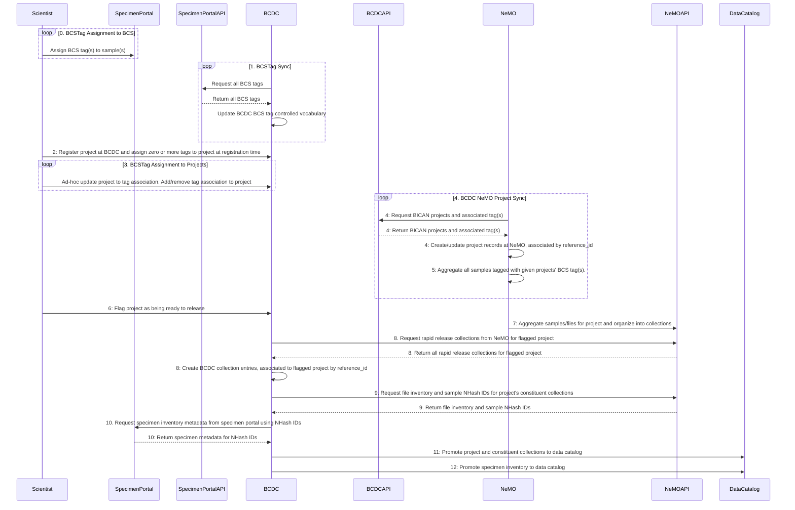

# Purpose
- The purpose of this document is to propose a strategy for organizing Barcoded Cell Sample Tags (BCSTags) and Project associations for the purpose of rapid release of BICAN data collections

# Out of scope
- Definition of set(s) of tags
    - All visible tags are understood as being standalone
    - Any tag can be associated with any project for the purposes of rapid release
- User association of tags with entities other than BCDC project
    - Tags will ONLY be associated with BCDC projects
    - Downstream systems will aggregate and partition data into collections
    - Upstream entities (sub-program and program) may infer tag association for viewing purposes, but association of tags to upstream entities will not be supported
- Authorization of users to specific set(s) of tags
    - All visible tags will be searchable and assignable to projects. 
    - BCDC will record the user(s) that create/update/delete project-tag associations
    - BCDC will NOT limit visibility of tags based on an authorization protocol.

# Sequence diagram


# Example flow
## 0. Scientist tags BCS entities at SpecimenPortal w/ free text tags:
|BCS|BCS_tag_name|
|---| ---|
|1234_A01|HMBA_Human_Atlas_BN_BF|
|1234_A01|HMBA_Human_Atlas|
|1234_B01|HMBA_Human_Atlas_BN_BF|
|1234_B01|HMBA_Human_Atlas|
|1234_C01|HMBA_Human_Atlas_M|
|1234_C01|HMBA_Human_Atlas|

- For this example:
    - 1234_A01 can be in an open access collection
    - 1234_B01 needs to be in a controlled access collection

## 1. BCDC pulls example set of tags from SpecimenPortal[^1]
```json
GET https://specimenportalapi.com/api/tags
{
    "data": [
        "HMBA_Human_Atlas",
        "HMBA_Human_Atlas_BN_BF",
        "HMBA_Human_Atlas_M",
    ]
}
```

## 2. Scientist registers projects for HMBA Human Atlas at BCDC and associates all HMBA human atlas tags. Project, on create, is marked `NOT_READY_TO_RELEASE`

|BCDC Project|BCS_tag_name|
|---|---|
|HMBA_human_atlas_proj|HMBA_Human_Atlas|
|HMBA_human_atlas_proj|HMBA_Human_Atlas_BN_BF|
|HMBA_human_atlas_proj|HMBA_Human_Atlas_M|
|HMBA_human_atlas_BN_BF_proj|HMBA_Human_Atlas_BN_BF|

## 4. NeMO pulls BICAN specific projects from BCDC
```json
GET https://bcdcapi.com/api/projects?program=BICAN
{
    "data": [
        {
            "project_reference_id": "HMBA_human_atlas_proj",
            "sub_program": "HMBA",
            "program": "BICAN",
            "title": "Example title",
            ...
            "tags": [
                "HMBA_Human_Atlas",
                "HMBA_Human_Atlas_BN_BF",
                "HMBA_Human_Atlas_M",
            ],
            "status": "NOT_READY_TO_RELEASE",
            ...
        },
        {
            "project_reference_id": "HMBA_human_atlas_BN_BF_proj",
            "sub_program": "HMBA",
            "program": "BICAN",
            "title": "Example title",
            ...
            "tags": [
                "HMBA_Human_Atlas_BN_BF",
            ],
            "status": "NOT_READY_TO_RELEASE",
            ...
        }
    ]
}
```
- Corresponding `project` records created at NeMO:
```json
GET https://nemoapi.com/api/project/
{
    "data": [
        {
            "id": "nemo:prj-1",
            "short_name": "HMBA_human_atlas_proj",
            ...
            "tags": [
                "HMBA_Human_Atlas",
                "HMBA_Human_Atlas_BN_BF",
                "HMBA_Human_Atlas_M",
            ],
            ...
        },
        {
            "id": "nemo:prj-2",
            "short_name": "HMBA_human_atlas_BN_BF_proj",
            ...
            "tags": [
                "HMBA_Human_Atlas_BN_BF",
            ],
        },
        ...
    ]
}
```

## 5. NeMO aggregates samples and files associated with BCS Tags[^2]
- This step isn't necessary to expose via API immediately, if there are constraints on exposing samples that aren't in collections
- Consider this an implementation detail for associating NeMO sample IDs to NHash IDs and the tags associated to the samples at portal providing the association
```json
GET https://nemoapi.com/api/samples/
{
    "data": [
        {
            "id": "nemo:smp-1", 
            "source_sample_id": "BC-1234_A01", // NHash ID corresponding to 1234_A01
            "tags": [
                "HMBA_Human_Atlas_BN_BF",
                "HMBA_Human_Atlas",
            ],
            "files": [
                "nemo:sqc-1",
                ...
            ],
            ...
        },
        {
            "id": "nemo:smp-2",
            "source_sample_id": "BC-1234_B01", // NHash ID corresponding to 1234_B01
            "tags": [
                "HMBA_Human_Atlas_BN_BF",
                "HMBA_Human_Atlas",
            ],
            "files": [
                "nemo:sqc-2",
                ...
            ]
        },
        {
            "id": "nemo:smp-3",
            "source_sample_id": "BC-1234_C01", //NHash ID corresponding to 1234_C01
             "tags": [
                "HMBA_Human_Atlas_M",
                "HMBA_Human_Atlas",
            ],
            "files": [
                "nemo:sqc-3",
                ...
            ]
        }
        ...
    ]
}
```

## 6. Scientist flags BCDC project as ready for release
- After flagging project as ready for release:
```json
GET https://bcdcapi.com/api/projects
{
    "data": [
        {
            "project_reference_id": "HMBA_human_atlas_proj",
            "sub_program": "HMBA",
            "program": "BICAN",
            "title": "Example title",
            ...
            "tags": [
                "HMBA_Human_Atlas",
                "HMBA_Human_Atlas_BN_BF",
                "HMBA_Human_Atlas_M",
            ],
            "status": "NOT_READY_TO_RELEASE",
            ...
        },
        {
            "project_reference_id": "HMBA_human_atlas_BN_BF_proj",
            "sub_program": "HMBA",
            "program": "BICAN",
            "title": "Example title",
            ...
            "tags": [
                "HMBA_Human_Atlas_BN_BF",
            ],
            "status": "READY_TO_RELEASE",
            ...
        }
    ]
}
```

## 7. NeMO organizes samples/files associated to project via BCS tags into collections[^3]
- In this example, `keywords` from API schema is being used to denote a `RapidRelease` collection vs others
- Mechanism of denoting collections as rapid release does not need to be `keywords`, but presumably SOME mechanism of flagging collections as BICAN rapid release collections will be needed.
```json
GET https://nemoapi.com/api/collection
{
    "data": [
        {
            "id": "nemo:col-1",
            "short_name": "HMBA_human_atlas_BN_BF_open",
            "name": "Example name",
            "projects": [
                "nemo:prj-2",
            ],
            "keywords": [
                "RapidRelease",
                ...
            ]
            ...
        },
        {
            "id": "nemo:col-2",
            "short_name": "HMBA_human_atlas_BN_BF_controlled",
            "name": "Example name",
            "projects": [
                "nemo:prj-2",
            ],
            "keywords": [
                "RapidRelease",
                ...
            ]
            ...
        },
        ...
    ]
} 
```

## 8. BCDC pulls collections from NeMO and creates BCDC collection entries, associated to project by reference_id
- In this example, a query string is being used to filter by `keyword` for `RapidRelease`
- Mechanism of denoting collections as rapid release does not need to be `keywords`, but presumably SOME mechanism of flagging collections as BICAN rapid release collections will be needed.

```json
GET https://nemoapi.com/api/collection?keyword=RapidRelease
{
    "data": [
        {
            "id": "nemo:col-1",
            "short_name": "HMBA_human_atlas_BN_BF_open",
            "name": "Example name",
            "access": "open",
            "license": "CC-BY-4.0",
            "technique": "10Xv3", // Will need to consolidate CVs or maintain synonyms in BICAN metadata repository?
            "projects": [
                "nemo:prj-2",
            ],
            ...
        },
        {
            "id": "nemo:col-2",
            "short_name": "HMBA_human_atlas_BN_BF_controlled",
            "name": "Example name",
            "technique": "10Xv3",
            "access": "controlled",
            "license": "DUC", // Licensing strategy for controlled collections?
            "projects": [
                "nemo:prj-2",
            ],
            ...
        },
        ...
    ]
}
```
- Query parent project to get project_short_name -> map to BCDC project reference_id
```json
GET https://nemoapi.com/api/project/nemo:prj-2
{
    "data": [
        {
            "id": "nemo:prj-2",
            "short_name": "HMBA_human_atlas_BN_BF_proj",
            ...
        }
    ]
}
```

- Collections created at BCDC
```json
GET https://bcdcapi.com/api/collections
{
    "data": [
        {
            "collection_reference_id": "HMBA_human_atlas_BN_BF_open",
            "project_reference_id": "HMBA_human_atlas_BN_BF_proj",
            "access_control": "open",
            "title": "Example title",
            "license": "CC-BY-4.0",
            ...
        },
        {
            "collection_reference_id": "HMBA_human_atlas_BN_BF_controlled",
            "project_reference_id": "HMBA_human_atlas_BN_BF_proj",
            "access_control": "controlled",
            "title": "Example title",
            "license": "DUC",
            ...
        }
    ]
}
```

## 9. BCDC pulls file inventory, sample NHash IDs for flagged project's constituent collections
- Query `/file` to get list of files associated to collection
```json
GET https://nemoapi.com/api/file?(collection=nemo:col-1|collection=nemo:col-2)
{
    "data": [
        {
            "id": "nemo:sqc-1",
            "file_name": "file1",
            "sample": "nemo:smp1",
            "collection": "nemo:col-1",
            "md5": "EXAMPLE_HASH",
            ...
        },
        {
            "id": "nemo:sqc-2",
            "file_name": "file2",
            "sample": "nemo:smp2",
            "collection": "nemo:col-2",
            "md5": "EXAMPLE_HASH",
            ...
        }
    ]
}
```

- Query `/sample` by collection ids to get NHash ids
```json
GET https://nemoapi.com/api/samples/?(collection=nemo:sqc-1|collection=nemo:sqc-2)
{
    "data": [
        {
            "id": "nemo:smp-1", 
            "source_sample_id": "BC-1234_A01", // NHash Id corresponding to 1234_A01
            "tags": [
                "HMBA_Human_Atlas_BN_BF",
                "HMBA_Human_Atlas",
            ],
            "files": [
                "nemo:sqc-1",
                ...
            ],
            ...
        },
        {
            "id": "nemo:smp-2", 
            "source_sample_id": "BC-1234_B01", // NHash Id corresponding to 1234_B01
            "tags": [
                "HMBA_Human_Atlas_BN_BF",
                "HMBA_Human_Atlas",
            ],
            "files": [
                "nemo:sqc-2",
                ...
            ],
            ...
        },
        ...
    ]
}
```

## 10. BCDC pulls specimen inventory from specimen portal using NHash IDs

```json
GET https://specimenportalapi.com/api/nhash_ids/info?id=BC-1234_A01
{
    "data": [ ... ]
}

GET https://specimenportalapi.com/api/nhash_ids/info?id=BC-1234_B01
{
    "data": [ ... ]
}
```

## 11. BCDC promotes flagged project and constituent collections to Brain Knowledge Platform (BKP) data catalog
- PRS ingest

## 12. BCDC promotes specimen inventory to data catalog
- IDF mutations

## Notes
[^1]: Tags are to be entered at SpecimenPortal as free text entries, but will be treated as a controlled vocabulary at BCDC. Users can only associate EXISTING, VISIBLE tags from SpecimenPortal's API to BCDC projects.

[^2]: Mechanism of aggregation TBD. Deposit from sequencing cores? Pull from SeqLib portal?

[^3]: Organization of collections at NeMO TBD. 
