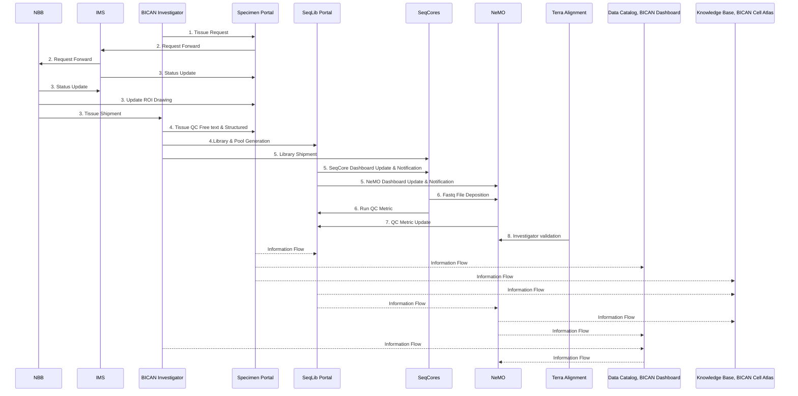

# Purpose
The purpose of this diagram is to show how data and materials flow across the BICAN ecosystem.

# Definitions
| Node Name       | Definition                                             |
|----------------|------------------------------------------------------|
| NBB            | Neuro Bio Bank                                       |
| IMS            | Information Management Services (https://www.imsweb.com/) |
| BICAN Investigator | TODO                                               |
| Specimen Portal | The Specimen Portal focuses on tissue management from donors to brain slabs and annotated brain samples.|
| SeqLib Portal | The Sequence Library (SeqLib) Portal manages the workflow starting from tissue, all the way downstream to track data deposition to assay-dependent data-modality-specific archives.|
| SeqCores       | TODO                                                 |
| NeMO           | TODO                                                 |
| Terra Alignment | TODO                                                 |
| Data Catalog, BICAN Dashboard | TODO                               |
| Knowledge Base, BICAN Cell Atlas | TODO                           |

# Sequence Diagram
